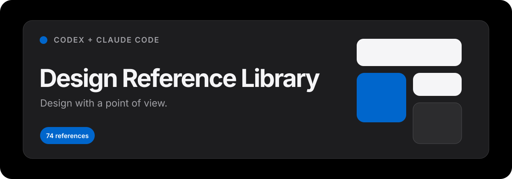

  

  <strong>A Codex and Claude Code plugin for turning curated visual references into coherent, buildable interface systems.</strong>

  
  
  

## What it does

Design Reference Library helps Codex and Claude Code restyle websites and application interfaces with a clear visual point of view. It can apply one named direction, recommend references from a mood, blend compatible systems, or synthesize a project-specific DESIGN.md.

The plugin contains:

- 74 curated design-system references across technology, retail, automotive, media, finance, and consumer brands
- A selection workflow for exact references, mood discovery, and controlled blends
- A synthesis guide for turning references into semantic tokens and implementation rules
- Accessibility, responsive-design, brand-integrity, and visual-QA guardrails
- Reproducible upstream sync and validation scripts

It preserves the product's content, identity, functionality, and information architecture. References are treated as creative constraints—not instructions to impersonate a brand.

## Install in Codex

Add this repository as a Git marketplace:

~~~powershell
codex plugin marketplace add JordanReighn/design-reference-library
~~~

Install the plugin:

~~~powershell
codex plugin add design-reference-library@jordanreighn-design
~~~

Start a new Codex task so the plugin is loaded, then try:

> Use Design Reference Library to restyle this website in an Apple-inspired direction.

The repository follows the plugin packaging structure described in the [official OpenAI plugin documentation](https://developers.openai.com/plugins/build/plugins).

## Install in Claude Code

Inside Claude Code, add the marketplace:

~~~text
/plugin marketplace add JordanReighn/design-reference-library
~~~

Install the plugin:

~~~text
/plugin install design-reference-library@jordanreighn-design
~~~

If Claude Code asks for it, run:

~~~text
/reload-plugins
~~~

Claude can invoke the skill automatically from a relevant request. You can also invoke it explicitly:

~~~text
/design-reference-library:design-reference-library Restyle this website in an Apple-inspired direction
~~~

The Claude package follows Anthropic's [official plugin](https://code.claude.com/docs/en/plugins) and [marketplace](https://code.claude.com/docs/en/plugin-marketplaces) structures.

## Example prompts

### Apply one reference

> Use Design Reference Library to restyle this repository in the Linear direction. Preserve its content and behavior, create a DESIGN.md, and verify desktop and mobile layouts.

### Start from a mood

> Use Design Reference Library to give this dashboard a calm, technical, dark-first visual language. Recommend the best reference before implementing it.

### Blend references

> Blend Stripe's editorial hierarchy with Linear's interface restraint. Use Stripe for marketing surfaces and Linear for the product UI.

### Generate only the design system

> Study this project and create a DESIGN.md using the Apple reference. Do not change implementation files yet.

More patterns are available in [docs/EXAMPLES.md](docs/EXAMPLES.md).

## How it works

1. Inspect the target product, its framework, and existing visual language.
2. Resolve an exact reference or select candidates from the catalog.
3. Extract principles, tokens, layout rules, component behaviors, and motion constraints.
4. Reconcile the reference with the product's own identity and requirements.
5. Write a project-specific DESIGN.md and implement the transformation.
6. Verify representative desktop and mobile views plus relevant interactions.

Only the selected reference files are loaded for a task, which keeps the working context focused.

## Reference catalog

The catalog spans:

- AI and developer tools
- SaaS and productivity
- Design and creative software
- Fintech and crypto
- E-commerce and retail
- Media and consumer technology
- Automotive, gaming, hardware, and enterprise

Browse the complete [design reference catalog](plugins/design-reference-library/skills/design-reference-library/references/catalog.md).

## Repository structure

~~~text
.
├── .agents/plugins/marketplace.json
├── .claude-plugin/marketplace.json
├── plugins/design-reference-library/
│   ├── .codex-plugin/plugin.json
│   ├── .claude-plugin/plugin.json
│   └── skills/design-reference-library/
│       ├── SKILL.md
│       ├── agents/openai.yaml
│       ├── references/
│       │   ├── catalog.md
│       │   ├── synthesis.md
│       │   └── designs/
│       └── scripts/
│           ├── sync_upstream.py
│           └── validate_library.py
├── docs/EXAMPLES.md
├── scripts/validate_manifests.py
├── LICENSE
└── NOTICE.md
~~~

## Keeping references current

From the repository root:

~~~powershell
python plugins/design-reference-library/skills/design-reference-library/scripts/sync_upstream.py
python scripts/validate_manifests.py
python plugins/design-reference-library/skills/design-reference-library/scripts/validate_library.py
~~~

The sync script updates only the vendored reference directory, generated catalog, provenance record, and upstream licence copy.

## Design and intellectual-property guardrails

- Brand names describe sources of visual inspiration and do not imply endorsement or affiliation.
- Do not copy logos, trademarks, copyrighted artwork, proprietary fonts, or distinctive branded copy.
- Translate references into general design principles and product-appropriate tokens.
- Use generic fallbacks when a proprietary asset is unavailable.
- Preserve the target product's identity, content, and behavior.

## Credits

The vendored reference analyses originate from [VoltAgent/awesome-design-md](https://github.com/VoltAgent/awesome-design-md) and are redistributed under the MIT License. Exact source provenance is recorded in [upstream.md](plugins/design-reference-library/skills/design-reference-library/references/upstream.md).

Plugin packaging, selection workflow, synthesis guidance, validation, and documentation are maintained in this repository.

## Contributing

Contributions are welcome. Read [CONTRIBUTING.md](CONTRIBUTING.md) before opening a pull request.

## License

MIT. See [LICENSE](LICENSE) and [NOTICE.md](NOTICE.md).
